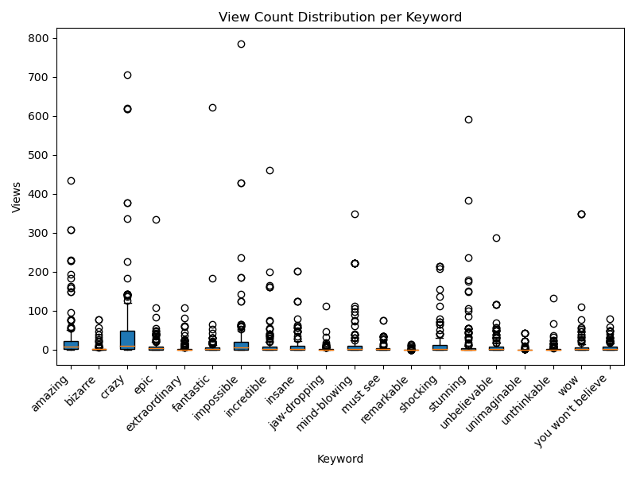

# DSA-210-PROJECT
 This is a data science project. It will experiment on data collected from YouTube. It will try to categorize YouTube videos, which keywords gets the most views, interactions.

## Data collection
  Data collection is done via python, the official youtube API.

## Keywords: 

The keywords are: "must see", "wow", "you won't believe", "impossible", "insane", "crazy", "unbelievable", "amazing", "incredible", "shocking", "mind-blowing", "epic", "bizarre", "jaw-dropping", "unthinkable", "extraordinary", "unimaginable", "stunning".

# Findings:

# 🎥 Hypothesis Test: Does the Keyword "crazy" Lead to More Views?

## 🔍 Research Question

Does including the keyword `"crazy"` in a video's metadata associate with **higher average views**?

---

## 📜 Hypotheses

Let:

- **μ₁** = mean view count for videos **with** the keyword `"crazy"`  
- **μ₂** = mean view count for videos **without** the keyword

### Null Hypothesis (H₀):
> μ₁ ≤ μ₂  
> Videos with `"crazy"` are **not** more viewed than others.

### Alternative Hypothesis (H₁):
> μ₁ > μ₂  
> Videos with `"crazy"` are **more** viewed on average.

---

## 📈 Data Summary

| Group                | Mean Views | Median | Count |
|---------------------|------------|--------|-------|
| With `"crazy"`      | *(computed)* | *(computed)* | *(n₁)* |
| Without `"crazy"`   | *(computed)* | *(computed)* | *(n₂)* |

*(fill with real values below)*

---

## 📦 View Distribution (Box Plot)

- This plot compares the distribution of view counts.
- The box shows the **interquartile range (IQR)**.
- Outliers are marked individually.

---

## 🧪 Statistical Test

We use a **Welch’s t-test** (unequal variances allowed) to compare the groups.

### Test Used:
- Type: One-tailed, two-sample Welch’s t-test
- Null: μ₁ ≤ μ₂  
- Alt:  μ₁ > μ₂

### Results:

- **t-statistic**: *...*
- **degrees of freedom**: *...*
- **p-value**: *...*

### Significance Level:
- α = 0.05

---

## ✅ Conclusion

If **p < 0.05**, we **reject** the null hypothesis:  
> Videos with `"crazy"` are **significantly** more viewed.

If **p ≥ 0.05**, we **fail to reject** the null:  
> No strong evidence that `"crazy"` leads to more views.

---

